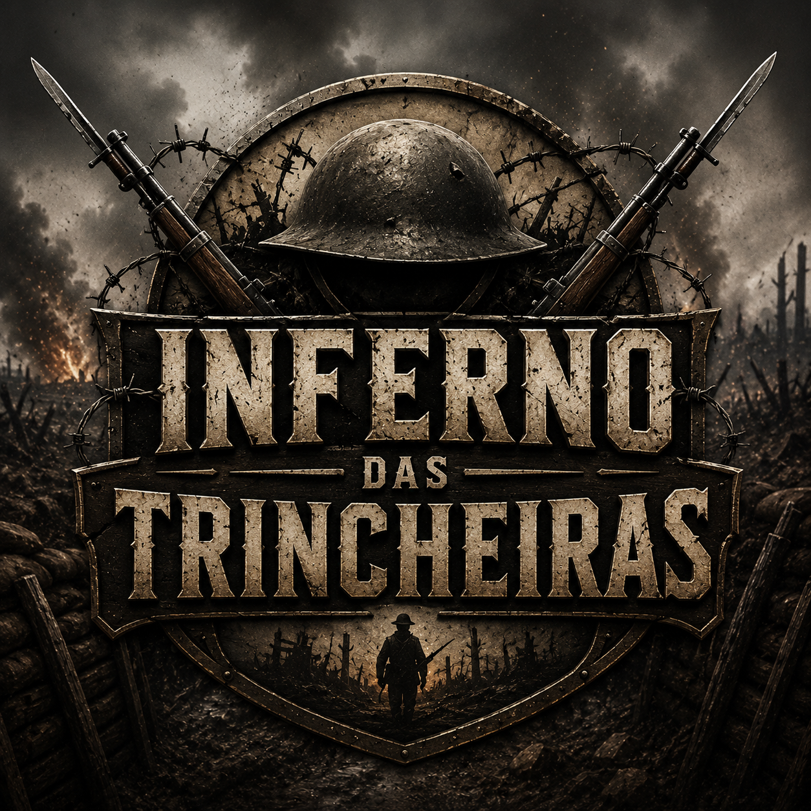

# Inferno das Trincheiras

<p align="center">

</p>

## Sobre

**Inferno das Trincheiras** é um jogo cooperativo e competitivo inspirado na Primeira Guerra Mundial, desenvolvido como trabalho escolar de História.

O jogo ocorre em tempo real através do navegador e utiliza cartas para representar eventos históricos, estratégias militares e recursos utilizados durante o conflito.

O objetivo é apresentar, de forma divertida e educativa, os principais acontecimentos da guerra, incentivando o trabalho em equipe e o pensamento estratégico.

---

# Objetivos Educacionais

O jogo aborda diversos temas da Primeira Guerra Mundial, como:

- Vida nas trincheiras
- Corrida armamentista
- Guerra química
- Espionagem
- Logística
- Moral das tropas
- Suprimentos
- Novas tecnologias militares
- Eventos históricos

Cada carta representa um acontecimento ou equipamento utilizado durante o conflito.

---

# Tecnologias

Backend

- Python
- Flask
- Flask-SocketIO

Frontend

- HTML5
- CSS3
- JavaScript

Comunicação

- WebSocket

---

# Estrutura

```
app.py
room.py
player.py
cards.py
game.py

/templates
    index.html

/static
    style.css
    game.js

/static/cards
    bombardeio.html
    gas_mostarda.html
    ...

/static/cards/img
    bombardeiro.img
    gas mostarda.png
```

---

# Recursos

✔ Salas online

✔ Código para entrar

✔ Até 8 jogadores

✔ Divisão automática dos times

✔ Sistema de turnos

✔ Cartas históricas

✔ Recursos compartilhados

✔ Objetivos estratégicos

✔ Interface responsiva

✔ Cartas individuais com arte própria

---

# Equipes

Os jogadores são divididos automaticamente em:

- Aliados
- Potências Centrais

Cada equipe possui recursos próprios.

---

# Recursos

Cada equipe possui:

- 🍖 Comida
- 💣 Munição
- ❤️ Moral
- 🛡 Integridade da Trincheira

Esses recursos podem ser aumentados, roubados ou destruídos pelas cartas.

---

# Condições de Vitória

Uma equipe vence quando:

- elimina todos os soldados inimigos;

ou

- reduz completamente os recursos inimigos;

ou

- cumpre o objetivo especial da missão.

---

# Trabalho Escolar

Disciplina:

História

Tema:

Primeira Guerra Mundial

Projeto desenvolvido para demonstrar conhecimentos históricos utilizando programação e desenvolvimento web.

---

## Licença

Projeto educacional.